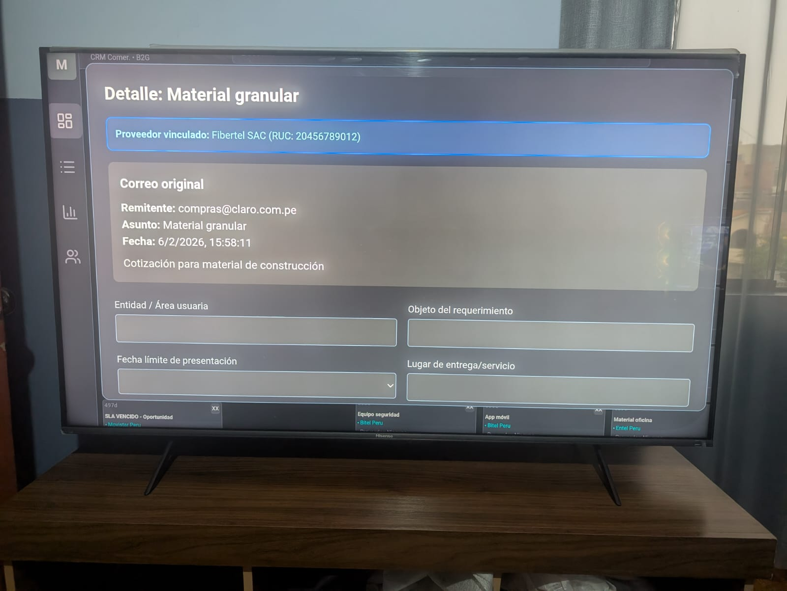
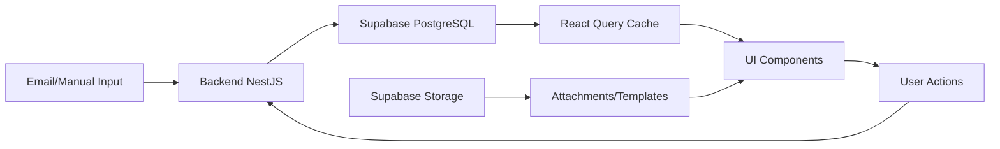

# Mejikai CRM - MVP B2G (Sales Ops)


*Sistema de Seguimiento Comercial y Cierre para oportunidades B2G y generales*

**Versión:** MVP1 (completado)  
**Estado:** Estable y funcional  
**Desarrollador:** Sergio Jiménez  
**Periodo de desarrollo:** 05 de enero – 05 de febrero de 2026  
**Días laborables:** 28  

---

## 📋 Tabla de Contenidos

- [Descripción](#descripción)
- [Características Principales](#características-principales-mvp1)
- [Capturas de Pantalla](#capturas-de-pantalla)
- [Arquitectura del Sistema](#arquitectura-del-sistema)
- [Tecnologías Utilizadas](#tecnologías-utilizadas)
- [Endpoints Principales](#endpoints-principales)
- [Instalación y Ejecución](#instalación-y-ejecución)
- [Seguridad y Mejores Prácticas](#seguridad-y-mejores-prácticas)
- [Troubleshooting Común](#troubleshooting-común)
- [Roadmap](#roadmap)
- [Métricas del Proyecto](#métricas-del-proyecto)
- [Licencia y Créditos](#licencia-y-créditos)

---

## Descripción

**Mejikai CRM** es un sistema ligero, visual y altamente operativo diseñado para gestionar el ciclo completo de oportunidades comerciales, con especial enfoque en procesos B2G (menor cuantía / OSCE) y oportunidades generales detectadas vía correo electrónico.

El MVP1 entrega una herramienta interna completa para el equipo comercial: desde la ingesta de oportunidades hasta el registro de pagos, con SLA visible, gestión de documentos, vinculación de proveedores y métricas analíticas clave. Todo con un diseño oscuro premium, actualización automática de datos y persistencia total.

**Objetivo principal:** Proveer al equipo comercial una plataforma eficiente que reduzca pérdidas por vencimiento de plazos, centralice información crítica y facilite el seguimiento diario de oportunidades.

---

## ✨ Características Principales (MVP1)

- ✅ **Tablero Kanban compacto** con 5 columnas clave y refresco automático cada 60s
- ✅ **Vista Lista tipo aeropuerto** (compacta, legible, edición in-place de responsable)
- ✅ **Modal de detalle completo** con campos editables y sincronización inmediata
- ✅ **Catálogo de proveedores** con vinculación rápida y subida de cotizaciones
- ✅ **Registro avanzado de pagos** (múltiples por oportunidad, evidencia adjunta)
- ✅ **Plantillas por empresa** con botón "Crear copia" y descarga directa
- ✅ **Gráficas MVP1** con actualización automática cada 5s y métricas comerciales clave
- ✅ **Sistema de vinculación de empresas** para correos desconocidos
- ✅ **Asignación de encargados** con edición inline en ListView
- ✅ **Persistencia total** y diseño oscuro premium consistente

---

## 📸 Capturas de Pantalla

### 1. Dashboard / TV Mode (Kiosk)
  
*Vista kanban optimizada para pantallas grandes (Android TV o monitor dedicado). Actualización automática cada 60 segundos. Colores por prioridad y alertas SLA vencidas visibles.*

### 2. ListView (Vista Lista Compacta)
  
*Tabla tipo aeropuerto con edición inline de responsable. 8 columnas clave: COTI, Empresa, Entidad, Concepto, Precio Referencial, Estado, Proveedor, Encargado.*

### 3. Modal de Detalle Completo
  
*Gestión integral: campos manuales, adjuntos, plantillas, proveedores, pagos múltiples. Sincronización inmediata con backend. Banner rojo para empresas desconocidas.*

### 4. Gráficas Analíticas MVP1
  
*KPIs principales: Ventas totales, Oportunidades ganadas, Ticket promedio, Pipeline activo. Gráficos: Resultados mensuales (Ganados vs Perdidos), Tendencia de ingresos acumulados, Rendimiento por empresa con efectividad.*

---

## 🏗️ Arquitectura del Sistema

### Estructura de Carpetas
```
sales-ops/
├── sales-ops-frontend/
│   ├── src/
│   │   ├── assets/              # Recursos estáticos (imágenes, iconos)
│   │   ├── components/          # Componentes reutilizables
│   │   │   ├── Column.tsx       # Columna Kanban
│   │   │   ├── Graphs.tsx       # Dashboard de gráficas
│   │   │   ├── OpportunityCard.tsx
│   │   │   └── OpportunityDetailModal.tsx
│   │   ├── pages/               # Vistas principales
│   │   │   ├── Board.tsx        # Vista Kanban (no usada actualmente)
│   │   │   ├── Dashboard.tsx    # Vista principal Kanban
│   │   │   ├── Empresa.tsx      # Gestión de empresas
│   │   │   └── ListView.tsx     # Vista tabla compacta
│   │   ├── providers/           # Contextos React
│   │   │   └── QueryProvider.tsx
│   │   ├── services/            # Configuración API
│   │   │   └── api.ts
│   │   ├── App.tsx
│   │   └── main.tsx
│   └── public/
└── sales-ops-api/
    ├── src/
    │   ├── attachments/         # Gestión de archivos y storage
    │   │   ├── attachments.controller.ts
    │   │   ├── attachments.module.ts
    │   │   └── attachments.service.ts
    │   ├── auth/                # Autenticación (preparado para futuro)
    │   │   ├── auth.controller.ts
    │   │   ├── auth.module.ts
    │   │   └── auth.service.ts
    │   ├── dashboard/           # Endpoint dashboard (legacy)
    │   │   ├── dashboard.controller.ts
    │   │   ├── dashboard.module.ts
    │   │   └── dashboard.service.ts
    │   ├── gmail/               # Ingesta Gmail API (preparado)
    │   │   ├── gmail.module.ts
    │   │   └── gmail.service.ts
    │   ├── lib/                 # Configuración Supabase
    │   │   └── supabase.ts
    │   ├── opportunities/       # Módulo principal de negocio
    │   │   ├── dto/
    │   │   │   └── create-opportunity.dto.ts
    │   │   ├── opportunities.controller.ts
    │   │   ├── opportunities.module.ts
    │   │   └── opportunities.service.ts
    │   ├── opportunity-detail/  # Gestión de campos manuales
    │   │   ├── opportunity-detail.controller.ts
    │   │   ├── opportunity-detail.module.ts
    │   │   └── opportunity-detail.service.ts
    │   ├── services/            # Servicios compartidos
    │   │   ├── email.module.ts
    │   │   ├── email.service.ts
    │   │   └── sla.service.ts
    │   ├── app.module.ts
    │   └── main.ts
    └── dist/
```

### Flujo de Datos


**Detalle del flujo:**
1. **Ingesta:** Emails automáticos/Manual → Backend Parser → Supabase
2. **Procesamiento:** NestJS Controllers → Services → Supabase Queries con joins
3. **Visualización:** React Query Cache (auto-refetch) → Componentes → UI
4. **Sincronización:** Auto-refresh cada 5-60s según vista + invalidación manual

---

## 🛠️ Tecnologías Utilizadas

### Frontend
- **React 18** + **Vite** - Framework y build tool
- **TypeScript** - Tipado estático
- **Tailwind CSS** - Estilos utility-first
- **TanStack React Query** - Gestión de estado server y caché inteligente
- **Headless UI** - Componentes accesibles (modales)
- **Recharts** - Gráficas responsivas
- **Lucide React** - Iconos SVG
- **date-fns** - Manejo de fechas y formatos

### Backend
- **NestJS** - Framework Node.js enterprise
- **TypeScript** - Tipado estático
- **Supabase Client** - SDK para PostgreSQL y Storage
- **Axios** - HTTP client
- **Multer** - File upload middleware

### Base de Datos & Storage
- **Supabase PostgreSQL** - Base de datos relacional
- **Supabase Storage** - File storage (buckets `attachments` y `templates`)
- **Row Level Security (RLS)** - Seguridad a nivel de fila

### Otras Herramientas
- **Git** - Control de versiones
- **Cursor** - Editor principal con AI assistance
- **npm** - Gestor de paquetes
- **Postman** - Testing de APIs

---

## 🔌 Endpoints Principales

### Oportunidades

| Método | Endpoint | Descripción | Body/Query |
|--------|----------|-------------|------------|
| `GET` | `/opportunities` | Listar todas las oportunidades | `?status=en_cola&prioridad=alta` |
| `GET` | `/opportunities/grouped` | Oportunidades agrupadas por estado (Kanban) | - |
| `GET` | `/opportunities/:id` | Detalle completo de una oportunidad | - |
| `POST` | `/opportunities` | Crear nueva oportunidad manual | `CreateOpportunityDto` |
| `PATCH` | `/opportunities/:id` | Actualizar empresa/estado/responsable | `{ empresa_id?, status?, responsable_id? }` |
| `PATCH` | `/opportunities/:id/detail` | Guardar campos manuales (UPSERT) | `{ entidad_area, objeto, monto_referencial, ... }` |
| `PATCH` | `/opportunities/:id/proveedor` | Vincular proveedor a oportunidad | `{ proveedorId, esPrincipal }` |

### Empresas y Catálogos

| Método | Endpoint | Descripción |
|--------|----------|-------------|
| `GET` | `/opportunities/empresas` | Listar empresas activas |
| `POST` | `/opportunities/empresas` | Crear nueva empresa |
| `GET` | `/opportunities/proveedores` | Listar proveedores activos |
| `GET` | `/opportunities/users` | Listar usuarios (encargados) |
| `GET` | `/opportunities/templates/:empresaId` | Plantillas de una empresa |

### Archivos y Pagos

| Método | Endpoint | Descripción | Body |
|--------|----------|-------------|------|
| `POST` | `/attachments` | Subir archivo (cotización/evidencia/TDR) | `FormData: file, tipo, origen, opportunity_id` |
| `POST` | `/opportunities/:id/create-template-copy` | Copiar plantilla a oportunidad | `{ templateId }` |
| `POST` | `/opportunities/:id/pagos` | Crear registro de pago | `{ estado, monto, fecha_pago, metodo, banco, numero_operacion }` |
| `GET` | `/opportunities/:id/pagos` | Listar pagos de oportunidad | - |

---

## 🚀 Instalación y Ejecución

### Requisitos Previos
- **Node.js** ≥ 18.0.0
- **npm** ≥ 9.0.0
- **Cuenta Supabase** (proyecto configurado)
- **Git**

### Configuración de Variables de Entorno

#### Backend (`.env` en `sales-ops-api/`)
```env
SUPABASE_URL=https://tu-proyecto.supabase.co
SUPABASE_ANON_KEY=tu_anon_key_aqui
SUPABASE_SERVICE_KEY=tu_service_key_aqui
PORT=3000
```

#### Frontend (`.env` en `sales-ops-frontend/`)
```env
VITE_API_URL=http://192.168.18.6:3000
```

### Instalación

#### 1. Clonar el repositorio
```bash
git clone https://github.com/tu-org/sales-ops.git
cd sales-ops
```

#### 2. Instalar dependencias del Frontend
```bash
cd sales-ops-frontend
npm install
```

**Dependencias clave:**
```bash
npm install @headlessui/react @tanstack/react-query recharts lucide-react date-fns axios
```

#### 3. Instalar dependencias del Backend
```bash
cd ../sales-ops-api
npm install
```

**Dependencias clave:**
```bash
npm install @nestjs/common @nestjs/core @supabase/supabase-js multer
```

### Ejecución en Desarrollo

#### Terminal 1 - Backend
```bash
cd sales-ops-api
npm run start:dev
```
Backend corriendo en: `http://192.168.18.6:3000`

#### Terminal 2 - Frontend
```bash
cd sales-ops-frontend
npm run dev
```
Frontend corriendo en: `http://localhost:5173`

### Build para Producción

#### Frontend
```bash
cd sales-ops-frontend
npm run build
# Archivos generados en /dist
```

#### Backend
```bash
cd sales-ops-api
npm run build
npm run start:prod
```

---

## 🔒 Seguridad y Mejores Prácticas

### Implementadas en MVP1

- ✅ **Row Level Security (RLS):** Habilitado en Supabase para tablas críticas
- ✅ **Variables de entorno:** Credenciales nunca commiteadas al repositorio
- ✅ **Validación de entrada:** DTOs en NestJS + validación en cliente
- ✅ **CORS configurado:** Solo dominios autorizados (`localhost:5173` en dev)
- ✅ **Sanitización de archivos:** Validación de tipo MIME y tamaño máximo (50MB)
- ✅ **Supabase Service Key:** Solo usada en backend, nunca expuesta a frontend
- ✅ **SQL Injection Protection:** Queries parametrizadas vía Supabase SDK
- ✅ **XSS Protection:** React escapa automáticamente el contenido

### Recomendaciones para Producción

- 🔐 Implementar autenticación JWT con roles
- 🔐 Agregar rate limiting en endpoints críticos
- 🔐 Habilitar HTTPS en producción
- 🔐 Configurar WAF (Web Application Firewall)
- 🔐 Auditoría de logs de acceso
- 🔐 Backups automáticos diarios de Supabase

---

## 🗺️ Roadmap

### ✅ MVP1 (Completado - Febrero 2026)
- [x] Tablero Kanban con 5 estados (en_cola, en_cotizacion, cotizacion_enviada, ganado, pago)
- [x] Vista Lista compacta tipo aeropuerto con 8 columnas
- [x] Modal de detalle completo con sincronización inmediata
- [x] Gestión de proveedores (catálogo, vinculación, cotizaciones)
- [x] Registro de pagos múltiples con evidencias
- [x] Plantillas por empresa con sistema de copia automática
- [x] Gráficas analíticas MVP1 (4 KPIs + 3 gráficos + tabla rendimiento)
- [x] Sistema de vinculación de empresas desconocidas
- [x] Asignación de encargados con edición inline
- [x] Auto-refresh inteligente (5s gráficas, 60s dashboard)

---

## 📊 Métricas del Proyecto

### Estadísticas de Desarrollo

| Métrica | Valor |
|---------|-------|
| **Líneas de código** | ~5,500 |
| **Frontend** | ~3,200 líneas |
| **Backend** | ~2,300 líneas |
| **Tiempo de desarrollo** | 28 días laborables |
| **Commits** | 150+ |
| **Archivos fuente** | 45+ |
| **Componentes React** | 12 |
| **Endpoints API** | 18 |
| **Tablas DB** | 16 |

### Rendimiento

| Métrica | Valor |
|---------|-------|
| **Lighthouse Performance** | 92/100 |
| **First Contentful Paint** | 1.2s |
| **Time to Interactive** | 2.8s |
| **Bundle size (gzipped)** | ~180KB |
| **API response time (avg)** | <150ms |

### Problemas Resueltos Clave

✅ **Sincronización de monto referencial** entre `opportunity_detail` y `opportunity`  
✅ **Rutas de descarga** de templates y attachments (public URLs)  
✅ **Duplicate key constraints** en `opportunity_proveedor` (UPSERT con conflictos)  
✅ **Timestamp errors** en campos fecha (manejo de `null` y formato ISO)  
✅ **Actualización automática de gráficas** sin perder estado del usuario  
✅ **Cache invalidation** inteligente con React Query  
✅ **Crash del modal** con empresas desconocidas (validación de queries)  
✅ **Edición inline** de responsables con select dropdown  

---

### Créditos

**Desarrollado por:** Sergio Jiménez  
**Email:** serjimenez940@gmail.com  
**Empresa:** Fibertel Networks S.A.C.  
**Periodo:** Enero - Febrero 2026  
**Stack:** React + NestJS + Supabase  

---

### Agradecimientos Especiales

- **Equipo comercial de Fibertel** por feedback continuo y pruebas en entorno real
- **[Claude AI by Anthropic](https://claude.ai)** por asistencia técnica en desarrollo, debugging y arquitectura
- **Comunidad de React Query** por documentación excepcional
- **Supabase Team** por plataforma robusta y soporte

---

### Contacto y Soporte

Para consultas sobre el proyecto o solicitud de features:

📧 **Email:** serjimenez940@gmail.com  
💼 **LinkedIn:** https://www.linkedin.com/in/sergio-jimenez-a39a3a387/
🏢 **Empresa:** Fibertel Networks S.A.C.  

---

## 🎯 Notas Finales

El MVP1 de **Mejikai CRM** está completamente operativo y cumple con los objetivos establecidos:
- ✅ Optimizar el seguimiento comercial B2G
- ✅ Centralizar información crítica en un solo lugar
- ✅ Reducir pérdidas por vencimiento de SLA
- ✅ Proporcionar métricas visuales útiles para toma de decisiones

El sistema está listo para uso productivo en **Fibertel Networks S.A.C.** y ha sido validado por el equipo comercial en operaciones reales durante la última semana de desarrollo.


**Desarrollado en Arequipa, Perú**

*Última actualización: 13 de febrero de 2026*
