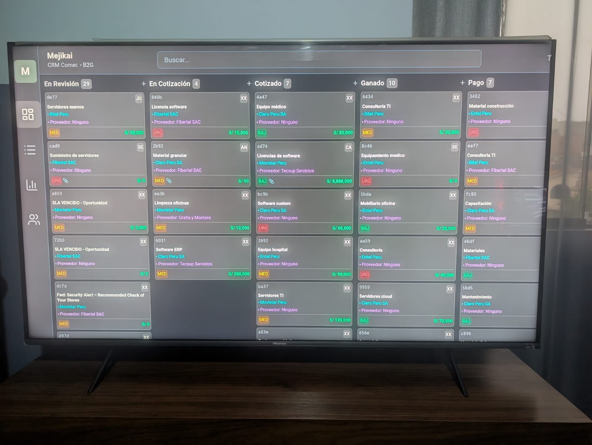
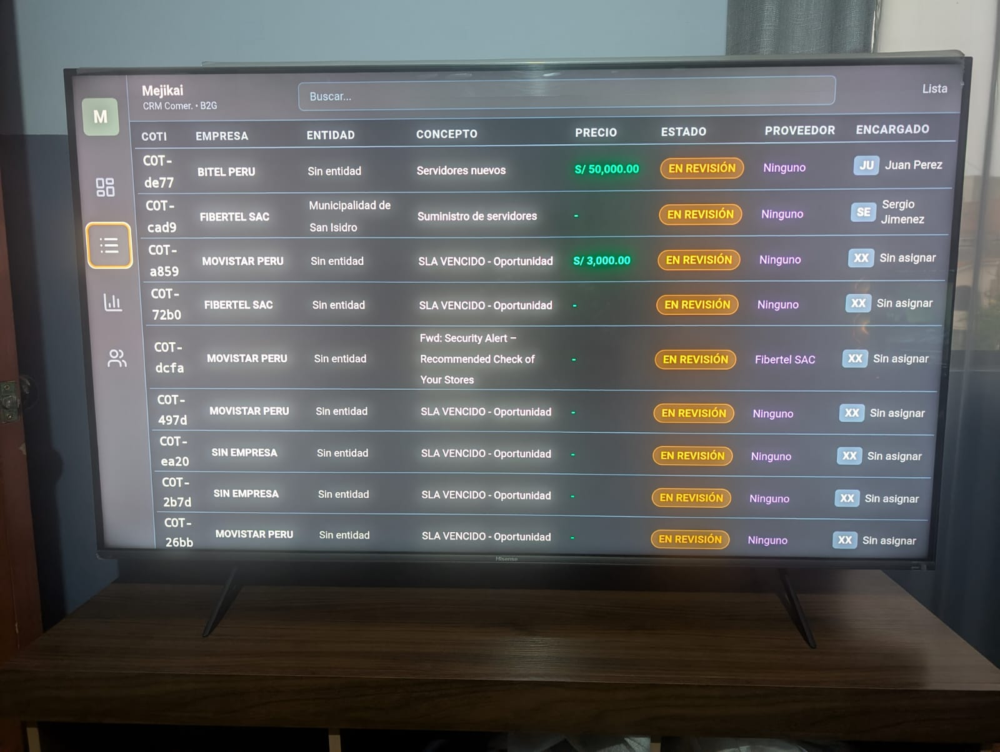
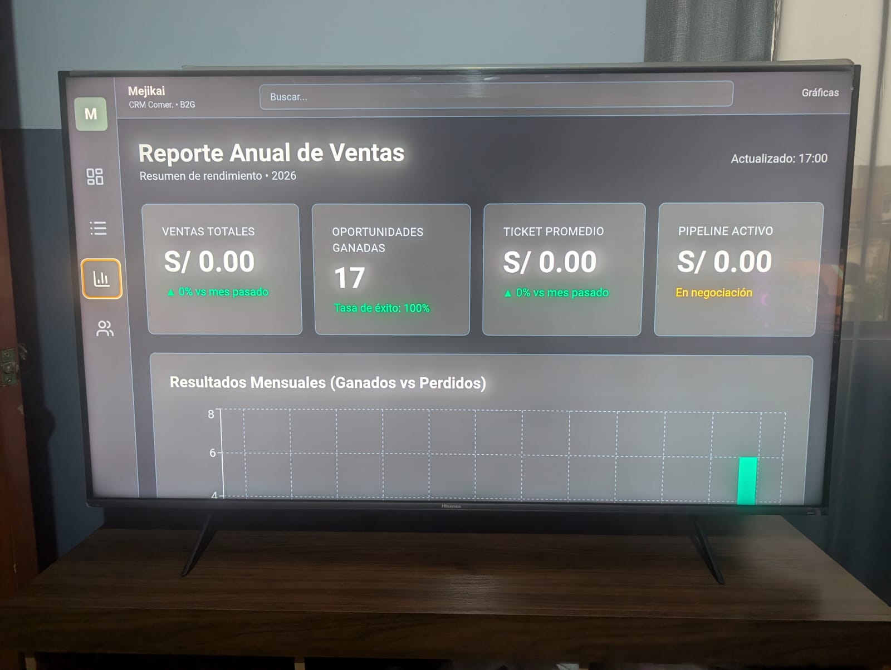

# Mejikai CRM - MVP B2G (Sales Ops)

  
*Sistema de Seguimiento Comercial y Cierre para oportunidades B2G y generales*

**Versión:** MVP1 (completado)  
**Estado:** Estable y funcional  
**Desarrollador:** Sergio Jiménez  
**Periodo de desarrollo:** 17 de enero – 13 de febrero de 2026  
**Días laborables:** 28  

---

## Descripción
**Mejikai CRM** es un sistema ligero, visual y altamente operativo diseñado para gestionar el ciclo completo de oportunidades comerciales, con especial enfoque en procesos B2G (menor cuantía / OSCE) y oportunidades generales detectadas vía correo electrónico.

El MVP1 entrega una herramienta interna completa para el equipo comercial: desde la ingesta de oportunidades hasta el registro de pagos, con SLA visible, gestión de documentos, vinculación de proveedores y métricas analíticas clave. Todo con un diseño oscuro premium, actualización automática de datos y persistencia total.

**Objetivo principal:** Proveer al equipo comercial una plataforma eficiente que reduzca pérdidas por vencimiento de plazos, centralice información crítica y facilite el seguimiento diario de oportunidades.

---

## Capturas de Pantalla

### Dashboard / TV Mode (Kiosk)
  
Vista kanban resumida optimizada para pantallas grandes (Android TV o monitor dedicado). Refresco automático cada 60 segundos.

### ListView (Vista Lista Tipo Aeropuerto)
  
Tabla compacta con todas las oportunidades, edición rápida de responsable y visualización inmediata de precio referencial.

### Gráficas Analíticas
  
Métricas clave: pipeline por etapas, ganadas vs perdidas, distribución por empresa/RUC y SLA promedio.

---

## Características Principales (MVP1)
- Tablero Kanban compacto con 5 columnas clave y refresco automático.
- Vista Lista tipo aeropuerto (apiñada, legible, edición in-place de responsable).
- Modal de detalle completo con campos editables y sincronización inmediata.
- Catálogo de proveedores con vinculación rápida y subida de cotizaciones.
- Registro avanzado de pagos (múltiples por oportunidad, evidencia adjunta).
- Plantillas por empresa con botón "Crear copia" y descarga directa.
- Gráficas MVP1 con actualización automática y métricas comerciales clave.
- Persistencia total y diseño oscuro premium consistente.

---

## Tecnologías Utilizadas

### Frontend
- React 18 + Vite
- TypeScript
- Tailwind CSS
- TanStack React Query (gestión de estado y caché inteligente)
- Headless UI (modales)
- Recharts (gráficas)
- Lucide React (iconos)
- date-fns (manejo de fechas)

### Backend
- NestJS
- TypeScript
- Supabase Client (consultas con joins)
- Axios (fetch desde frontend)

### Base de Datos & Storage
- Supabase PostgreSQL
- Supabase Storage (buckets `attachments` y `templates`)

### Otras Herramientas
- Git (control de versiones)
- Cursor (editor principal)
- npm / yarn

---

## Instalación y Ejecución

### Requisitos
- Node.js ≥ 18
- Cuenta Supabase (proyecto configurado)
- Variables de entorno en `.env` (SUPABASE_URL, SUPABASE_ANON_KEY)

### Pasos

#### Frontend
```bash
cd sales-ops-frontend
npm install
npm install @headlessui/react @tanstack/react-query recharts lucide-react date-fns
npm run dev
Backend
Bashcd sales-ops-api
npm install
npm run start:dev
Accede a http://localhost:5173 (frontend) y asegúrate de que el backend esté corriendo en http://localhost:3000.

Métricas del Proyecto

Líneas de código aproximadas: ~5000 (frontend + backend)
Tiempo de desarrollo: 28 días laborables
Estado actual: MVP1 completado, estable y listo para uso real
Problemas resueltos clave: sincronización de monto referencial, rutas de descarga, duplicate key constraints, timestamp errors, actualización automática de gráficas


Notas Finales
El MVP1 de Mejikai CRM está completamente operativo y cumple con los objetivos establecidos: optimizar el seguimiento comercial B2G, centralizar información crítica y proporcionar métricas visuales útiles.
Recomendaciones para iteraciones futuras:

Implementar drag & drop en Kanban
Autenticación y roles de usuario
Notificaciones push/email por SLA vencido
Exportación PDF de oportunidades
Integración automática de correos (Gmail API)

Proyecto desarrollado con dedicación y enfoque en usabilidad real para el equipo comercial de Fibertel Networks S.A.C.
Contacto: sergio.mejia@mejikai.com